# Rapport — Labo 09 : bases de données et verrous distribués

**Cours :** LOG430 — Architecture logicielle  
**Nom :** [Nom]  
**Code permanent :** [Code permanent]  
**Groupe :** [Groupe]  
**Date :** [Date]

## Introduction

[Présenter brièvement le contexte et les objectifs du laboratoire.]

## Environnement expérimental

| Élément | Information |
|---|---|
| Système d'exploitation | [À compléter] |
| Processeur | [À compléter] |
| Mémoire vive | [À compléter] |
| Version de Docker | [À compléter] |
| Version de YugabyteDB | [À compléter] |
| Version de CockroachDB | [À compléter] |

## Question 1 — Schéma et cluster YugabyteDB

**Question :** Quelle est la sortie du terminal obtenue après le test de
concurrence? La sortie est-elle identique sur `yugabyte1`, `yugabyte2` et
`yugabyte3`?

### Schéma de la table `orders`

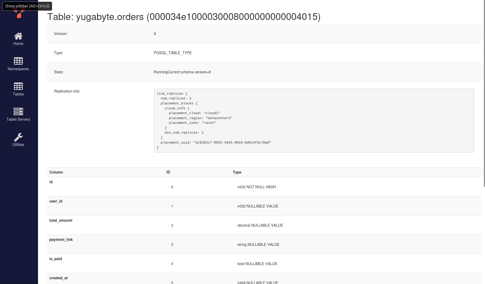

*Figure 1 — Schéma de la table `orders` observé dans YB Master UI.*

### Table avant le test de concurrence

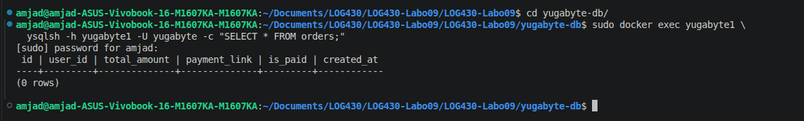

*Figure 2 — La table `orders` est vide avant l'exécution du test.*

### Test de concurrence à cinq threads

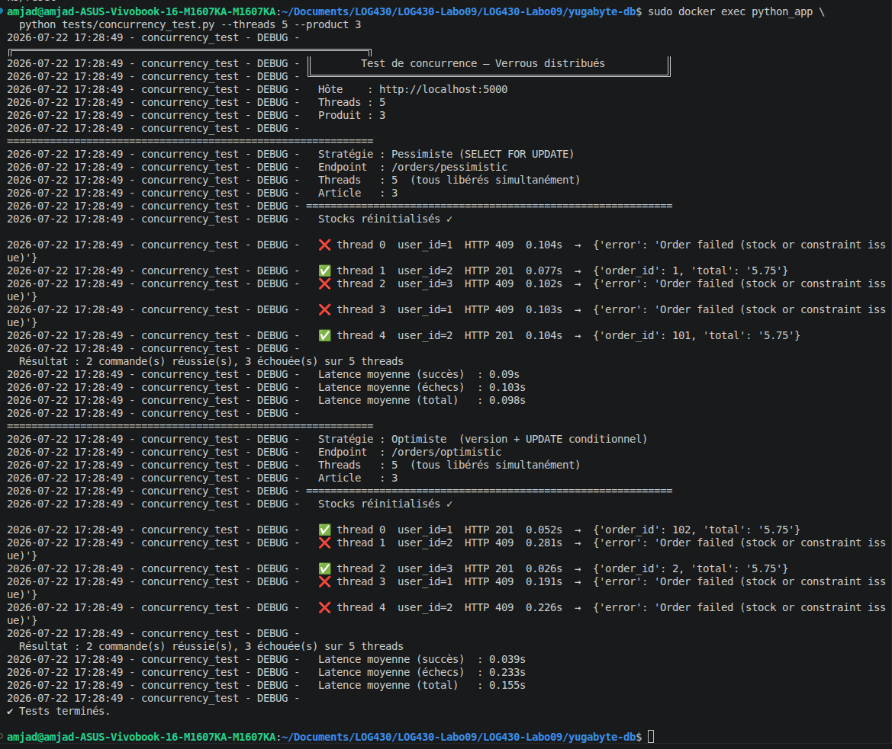

*Figure 3 — Exécution des stratégies pessimiste et optimiste avec cinq threads.*

### Sortie de `yugabyte1`

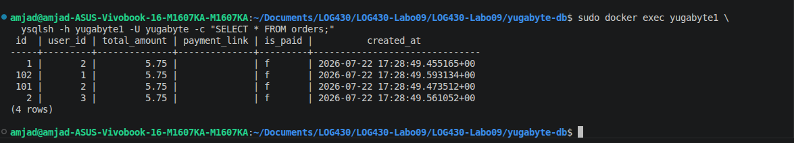

*Figure 4 — Les quatre commandes créées sont visibles depuis `yugabyte1`.*

### Sortie de `yugabyte2`

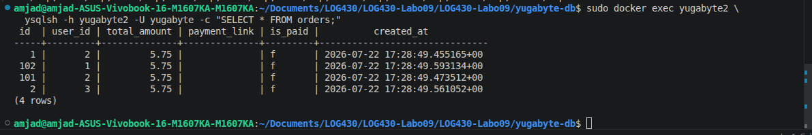

*Figure 5 — Les quatre commandes sont également visibles depuis `yugabyte2`.*

### Sortie de `yugabyte3`

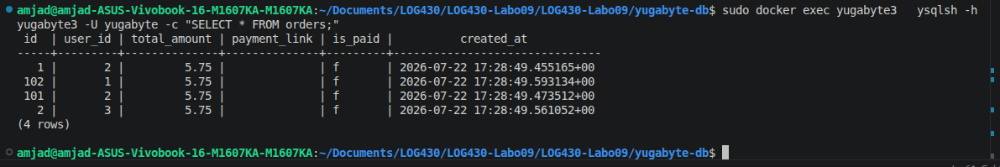

*Figure 6 — Les quatre commandes sont également visibles depuis `yugabyte3`.*

### Réponse

[Comparer les trois sorties et expliquer le résultat.]

**Capture supplémentaire du résultat sauvegardé :**

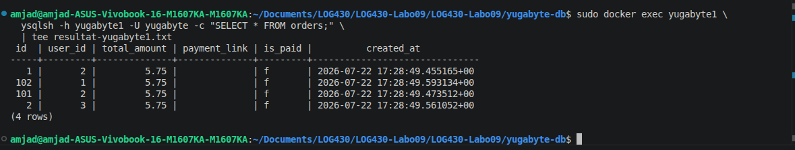

*Figure 7 — Sortie de la requête sur `yugabyte1` sauvegardée avec `tee`.*

## Question 2 — Verrouillage avec 20 threads

**Question :** Quelle approche présente la latence moyenne la plus élevée et
pourquoi?

| Stratégie | Commandes réussies | Commandes échouées | Latence moyenne des succès | Latence moyenne des échecs | Latence moyenne totale |
|---|---:|---:|---:|---:|---:|
| Pessimiste | 2 | 18 | 0,109 s | 0,192 s | 0,183 s |
| Optimiste | 2 | 18 | 0,077 s | 0,307 s | 0,285 s |

**Sortie complète :** [test de concurrence à 20 threads](captures/concurrency-test-20-threads.txt)

**Stock après le test :** [résultat de l'API `/stocks`](captures/stocks-after-20-threads.txt)

Le produit 3 possède une quantité finale de **0**. Les deux stratégies ont donc
accepté exactement deux commandes, conformément au stock initial de deux unités.

### Réponse

L'approche optimiste présente la latence moyenne totale la plus élevée :
**0,285 s**, contre **0,183 s** pour l'approche pessimiste. Sous la forte
contention produite par 20 threads visant la même ligne, plusieurs transactions
optimistes lisent simultanément la même version. Lorsqu'une transaction modifie
le stock, les autres détectent un conflit lors de l'écriture et doivent annuler
leur transaction, attendre, puis recommencer. Ces tentatives supplémentaires
augmentent surtout la latence moyenne des requêtes échouées, qui atteint
**0,307 s**.

Le verrouillage pessimiste bloque plutôt les transactions concurrentes dès le
`SELECT FOR UPDATE`. Dans cette exécution, cette mise en attente contrôlée coûte
moins cher que les reprises optimistes. Il faut toutefois noter que la latence
moyenne des deux commandes réussies est légèrement plus faible avec l'approche
optimiste (**0,077 s** contre **0,109 s**); la conclusion sur la latence la plus
élevée repose donc sur la moyenne totale de toutes les requêtes.

**Capture d'écran :** [Insérer la capture du test à 20 threads ici]

## Question 3 — Verrouillage avec 5 threads

**Question :** Avec cinq threads, quelle approche présente la latence moyenne la
plus élevée et pourquoi?

| Stratégie | Commandes réussies | Commandes échouées | Latence moyenne des succès | Latence moyenne des échecs | Latence moyenne totale |
|---|---:|---:|---:|---:|---:|
| Pessimiste | 2 | 3 | 0,090 s | 0,103 s | 0,098 s |
| Optimiste | 2 | 3 | 0,039 s | 0,233 s | 0,155 s |

Les deux stratégies ont accepté deux commandes et refusé les trois commandes
excédant le stock disponible.

### Réponse

Avec cinq threads, l'approche optimiste présente encore la latence moyenne totale
la plus élevée : **0,155 s**, contre **0,098 s** pour l'approche pessimiste. Les
requêtes optimistes qui entrent en conflit doivent être annulées et réessayées;
leur latence moyenne atteint **0,233 s**. Le verrou pessimiste met plutôt les
transactions concurrentes en attente et obtient ici une moyenne totale plus
faible.

Les latences des deux stratégies sont inférieures à celles mesurées avec 20
threads, puisque la ligne de stock subit moins de contention. Comme dans le test
à 20 threads, les commandes optimistes qui réussissent sont rapides, mais le coût
des échecs et des reprises augmente leur moyenne totale.

**Capture d'écran :**


*Figure 8 — Résultats du test de concurrence avec cinq threads.*

## Question 4 — Test de charge avec YugabyteDB

**Paramètres Locust :**

- Nombre d'utilisateurs : 50
- Taux d'apparition : 5 utilisateurs par seconde
- Durée : 60 secondes

| Stratégie | Nombre de requêtes | Nombre d'échecs | Taux d'erreurs | Latence moyenne | Requêtes/s |
|---|---:|---:|---:|---:|---:|
| Pessimiste | 3 824 | 2 737 | 71,57 % | 27,73 ms | 63,70 |
| Optimiste | 2 596 | 1 788 | 68,88 % | 207,73 ms | 43,25 |

### Réponse

Les deux critères ne désignent pas la même stratégie. Le verrouillage
**optimiste** affiche le taux d'erreurs le plus faible avec **68,88 %**, contre
**71,57 %** pour le verrouillage pessimiste. En revanche, le verrouillage
**pessimiste** présente de loin la latence moyenne la plus faible avec
**27,73 ms**, contre **207,73 ms** pour le verrouillage optimiste.

Sous cette charge, les transactions optimistes concurrentes peuvent lire la même
version du stock. Après la première écriture, les autres détectent un conflit et
doivent recommencer, ce qui augmente leur temps de réponse. Le verrou pessimiste
sérialise plutôt les accès concurrents avec `SELECT FOR UPDATE`; dans cette
exécution, cette attente est moins coûteuse que les reprises optimistes et permet
aussi un débit plus élevé (**63,70** contre **43,25 requêtes/s**).

Les réponses HTTP 409 sont comptabilisées comme des échecs par Locust. Elles
peuvent représenter un refus normal lorsque le stock est épuisé, et pas
nécessairement une défaillance du verrou. Le taux élevé doit donc être interprété
dans le contexte du stock limité et du fait que celui-ci est seulement
réinitialisé au début du test.

**Capture des statistiques Locust :**

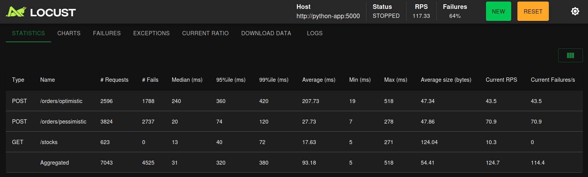

*Figure 9 — Statistiques du test de charge YugabyteDB pendant 60 secondes.*

**Données exportées :**

- [Statistiques des requêtes](captures/yugabytedb-locust-requests.csv)
- [Détail des échecs](captures/yugabytedb-locust-failures.csv)
- [Rapport Locust complet](captures/yugabytedb-locust-report.html)

**Capture des graphiques Locust :** [Insérer la capture ici]

## Question 5 — Résilience du cluster YugabyteDB

| Mesure | Avant l'arrêt | Pendant le basculement | Après stabilisation |
|---|---:|---:|---:|
| Taux d'erreurs cumulé affiché | 100 % | 96 % | 96 % |
| Latence moyenne par phase | Non isolée | Non isolée | Non isolée |
| Requêtes/s | 109,93 | 118,99 | 122,10 |

**Nœud arrêté :** `yugabyte2`  
**Heure de l'arrêt :** 15 h 33 min 51 s  
**Fin de la commande d'arrêt :** 15 h 34 min 06 s  
**Heure de stabilisation observée :** environ 15 h 34 min 06 s  
**Durée approximative du basculement :** environ 15 secondes

### Réponse

Le taux d'erreurs cumulé affiché par Locust **n'a pas augmenté de façon
observable** lors de l'arrêt de `yugabyte2`. Il était déjà de 100 % avant la
panne, puis affichait 96 % pendant et après la période observée. Cette valeur est
principalement causée par les réponses HTTP 409 produites lorsque les stocks sont
épuisés; elle ne constitue donc pas, à elle seule, un bon indicateur de la
disponibilité de la grappe.

La commande `docker stop yugabyte2` a été lancée à **15 h 33 min 51 s** et s'est
terminée à **15 h 34 min 06 s**. La durée approximative retenue pour le
basculement est donc de **15 secondes**. Le débit ne s'est pas effondré : il est
passé d'environ **109,93 requêtes/s** avant l'arrêt à **118,99 requêtes/s**
pendant l'observation, puis à **122,10 requêtes/s** après stabilisation. La grappe
a donc continué à servir les requêtes avec deux nœuds actifs.

Les données exportées comptabilisent toutefois **1 298 erreurs HTTP 500** sur
`/stocks` et une erreur HTTP 500 sur `/orders/optimistic`. Elles montrent aussi
des temps de réponse maximaux proches de **15 secondes**. Comme certaines erreurs
500 apparaissent dès le début du test, elles ne peuvent pas toutes être
attribuées avec certitude à l'arrêt de `yugabyte2`. La latence moyenne de
l'ensemble du test est de **93,43 ms**, mais l'export Locust ne fournit pas une
moyenne distincte pour chacune des trois phases.

Après le redémarrage, `yugabyte2` est revenu à l'état `Up` et le débit observé
atteignait **123,56 requêtes/s**. Le cluster a donc maintenu son service pendant
la panne, puis réintégré le nœud redémarré.

**Capture avant l'arrêt :**

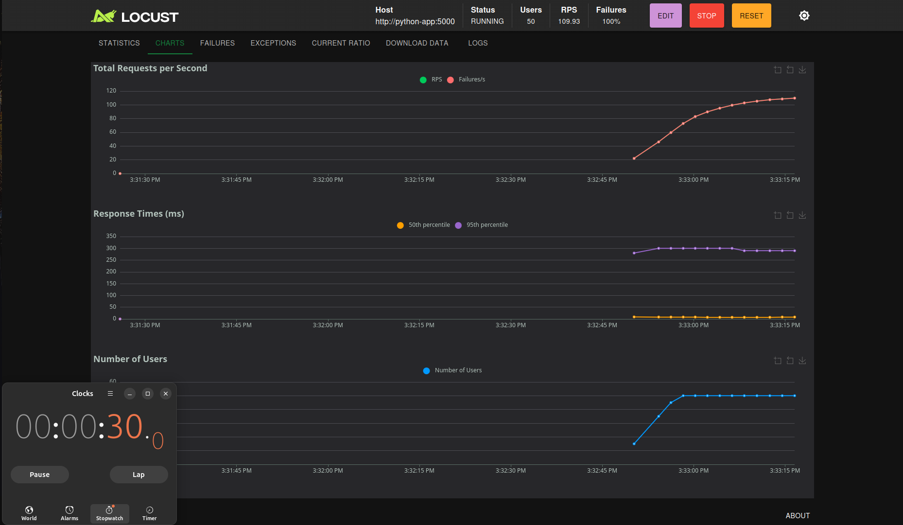

*Figure 10 — Charge de 50 utilisateurs avant l'arrêt de `yugabyte2`.*

**Capture pendant le basculement :**

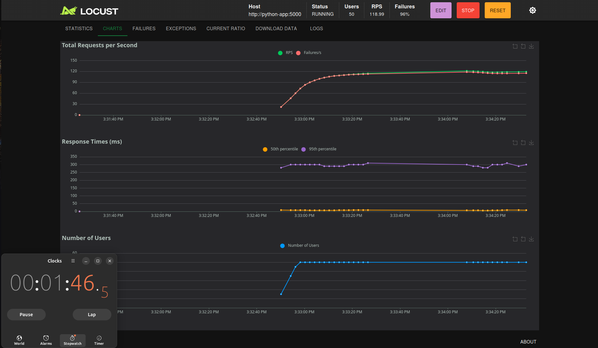

*Figure 11 — Évolution du débit et des temps de réponse pendant le basculement.*

**Capture après la stabilisation :**

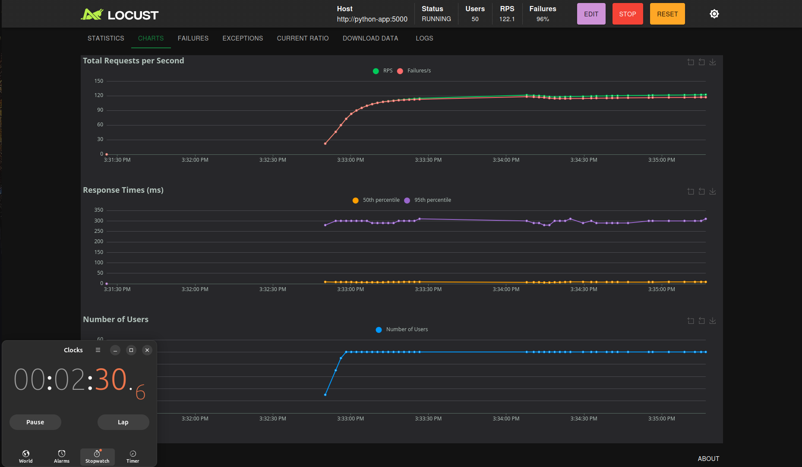

*Figure 12 — Le débit demeure stable avec deux nœuds actifs.*

**Capture après le redémarrage :**

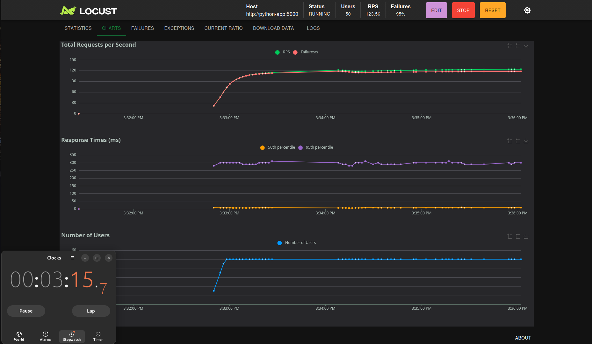

*Figure 13 — Reprise observée après le redémarrage de `yugabyte2`.*

**Données exportées :**

- [Chronologie de l'arrêt et du redémarrage](yugabyte-db/captures/yugabytedb-failover-events.txt)
- [Statistiques des requêtes](yugabyte-db/captures/yugabytedb-failover-requests.csv)
- [Détail des échecs](yugabyte-db/captures/yugabytedb-failover-failures.csv)
- [Rapport Locust complet](yugabyte-db/captures/yugabytedb-failover-report.html)

## Question 6 — Test de charge avec CockroachDB

**Paramètres Locust :**

- Nombre d'utilisateurs : 50
- Taux d'apparition : 5 utilisateurs par seconde
- Durée : 60 secondes

| Stratégie | Nombre de requêtes | Nombre d'échecs | Taux d'erreurs | Latence moyenne | Requêtes/s |
|---|---:|---:|---:|---:|---:|
| Pessimiste | 3 912 | 3 055 | 78,09 % | 21,85 ms | 65,17 |
| Optimiste | 3 667 | 2 932 | 79,96 % | 46,78 ms | 61,09 |

### Réponse

Avec CockroachDB, la stratégie **pessimiste** obtient à la fois le taux d'erreurs
le plus faible et la latence moyenne la plus basse. Son taux d'erreurs est de
**78,09 %**, contre **79,96 %** pour la stratégie optimiste, et sa latence
moyenne est de **21,85 ms**, contre **46,78 ms**.

Le verrouillage pessimiste acquiert immédiatement un verrou sur la ligne avec
`SELECT FOR UPDATE`. Les transactions concurrentes sont mises en attente et
lisent ensuite un état à jour. Le verrouillage optimiste autorise les lectures
simultanées, mais doit recommencer une transaction lorsqu'une version devenue
obsolète est détectée. CockroachDB utilise également l'isolation `SERIALIZABLE`,
qui peut entraîner des reprises supplémentaires lors des conflits. Sous la
contention de ce test, l'attente pessimiste coûte donc moins cher que les reprises
optimistes.

Comme pour YugabyteDB, les réponses HTTP 409 dues au manque de stock sont
comptabilisées comme des échecs par Locust. Le taux élevé ne représente donc pas
uniquement des erreurs techniques du mécanisme de verrouillage.

**Capture des statistiques Locust :**

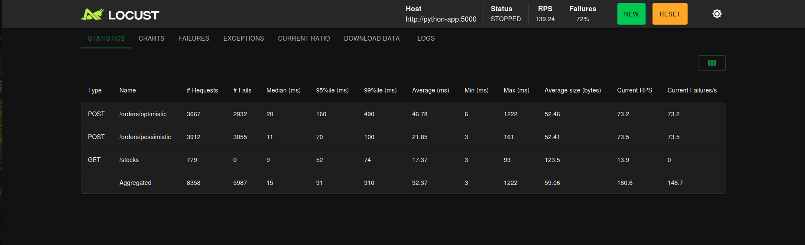

*Figure 14 — Statistiques du test CockroachDB avec 50 utilisateurs pendant 60 secondes.*

**Capture des graphiques Locust :**

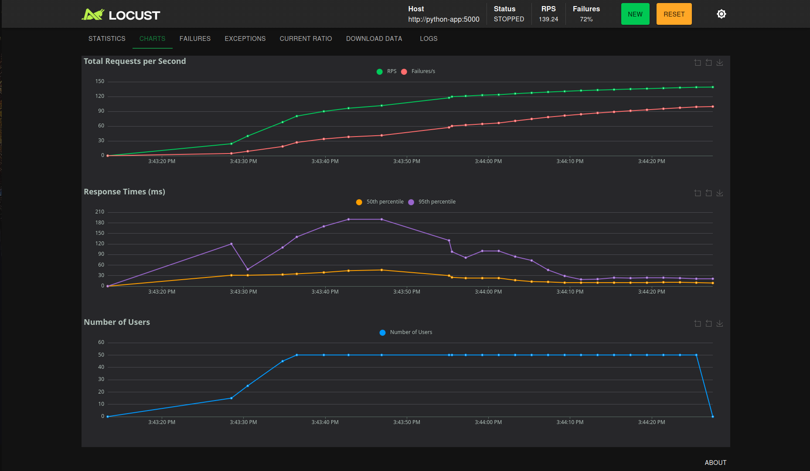

*Figure 15 — Débit, temps de réponse et nombre d'utilisateurs du test CockroachDB.*

**Données exportées :**

- [Statistiques des requêtes](cockroach-db/captures/cockroachdb-locust-requests.csv)
- [Détail des échecs](cockroach-db/captures/cockroachdb-locust-failures.csv)
- [Rapport Locust complet](cockroach-db/captures/cockroachdb-locust-report.html)

## Question 7 — Comparaison des bases de données

| Base de données | Stratégie | Taux d'erreurs | Latence moyenne | Requêtes/s |
|---|---|---:|---:|---:|
| YugabyteDB | Pessimiste | 71,57 % | 27,73 ms | 63,70 |
| YugabyteDB | Optimiste | 68,88 % | 207,73 ms | 43,25 |
| CockroachDB | Pessimiste | 78,09 % | 21,85 ms | 65,17 |
| CockroachDB | Optimiste | 79,96 % | 46,78 ms | 61,09 |

### Réponse

Les deux critères ne désignent pas une seule base gagnante. **YugabyteDB**
affiche le taux d'erreurs le plus faible : son meilleur résultat est
**68,88 %** avec la stratégie optimiste, contre un minimum de **78,09 %** pour
CockroachDB avec la stratégie pessimiste. **CockroachDB** affiche toutefois la
latence la plus faible : **21,85 ms** en mode pessimiste, contre un minimum de
**27,73 ms** pour YugabyteDB dans le même mode.

La comparaison stratégie par stratégie mène à la même observation. CockroachDB
répond plus rapidement dans les deux modes, tandis que YugabyteDB présente un
taux de refus plus faible dans les deux modes. CockroachDB atteint également un
débit supérieur en mode optimiste (**61,09 contre 43,25 requêtes/s**) et un débit
légèrement supérieur en mode pessimiste (**65,17 contre 63,70 requêtes/s**).

Dans les conditions de ce laboratoire, CockroachDB est donc préférable si la
priorité est la latence et le débit. YugabyteDB est préférable si la priorité est
le taux d'erreurs observé. Cette conclusion est limitée à un test local : les
trois nœuds partagent la même machine et les réponses 409 liées à l'épuisement
des stocks influencent fortement les taux d'erreurs.

**Captures comparatives :**

- [Statistiques YugabyteDB](captures/yugabytedb-locust-statistics.png)
- [Statistiques CockroachDB](cockroach-db/captures/cockroachdb-locust-statistics.png)

## Préparation de l'environnement de production

### Base de données choisie

La base de données choisie pour le déploiement est **YugabyteDB**. Les tests de
charge montrent que YugabyteDB obtient le plus faible taux d'erreurs observé,
soit **68,88 %** avec la stratégie optimiste. Le test de résilience montre aussi
que la grappe continue à traiter les requêtes après l'arrêt d'un nœud. Enfin,
YugabyteDB demeure un logiciel libre, tandis que CockroachDB utilise maintenant
une licence *source available* qui limite son utilisation commerciale gratuite.

CockroachDB a obtenu une meilleure latence, mais YugabyteDB est retenu ici pour
sa résilience vérifiée, son taux de refus plus faible et son modèle de licence.

### Description de la VM

| Élément | Configuration |
|---|---|
| Fournisseur ou hyperviseur | [À compléter] |
| Système d'exploitation | [À compléter] |
| Processeurs virtuels | [À compléter] |
| Mémoire vive | [À compléter] |
| Stockage | [À compléter] |
| Adresse ou nom d'hôte | [À compléter] |

### Procédure de déploiement

1. Créer une VM Linux et autoriser uniquement les ports nécessaires dans son
   pare-feu. Les ports d'administration et de base de données doivent idéalement
   demeurer accessibles seulement depuis un réseau privé.
2. Installer Git, Docker Engine et le module Docker Compose sur la VM.
3. Dans les paramètres GitHub du dépôt, ajouter un runner auto-hébergé Linux et
   installer le service du runner sur la VM.
4. Ajouter au runner l'étiquette `labo09-production`, utilisée par le travail de
   déploiement du pipeline.
5. Envoyer une modification sur la branche `main` ou lancer manuellement le
   workflow. Le travail `concurrency-test` démarre une grappe temporaire et doit
   réussir avant que le travail `deploy` soit rendu disponible.
6. Le travail `deploy` récupère le dépôt sur la VM, crée le fichier `.env`, puis
   exécute `docker compose up -d --build --remove-orphans` dans `yugabyte-db`.
7. Le pipeline interroge `/health` pendant un maximum de cinq minutes. Si l'API
   répond, il affiche l'état des conteneurs; sinon, il affiche les journaux et
   marque le déploiement comme échoué.

Pour une production réelle, les trois nœuds devraient être distribués sur des VM
ou des zones distinctes. Trois conteneurs sur une même VM démontrent la
réplication, mais ne protègent pas contre la panne complète de cette VM. Il
faudrait également activer l'authentification et TLS, employer des versions
d'images fixes, automatiser les sauvegardes et superviser la grappe.

### Fichier d'intégration continue

**Nom du fichier CI :** `.github/workflows/deploy-yugabyte.yml`

Le fichier complet est disponible ici :
[workflow de test et déploiement](.github/workflows/deploy-yugabyte.yml).

Le workflow contient deux travaux dépendants. Le premier démarre YugabyteDB sur
un runner GitHub hébergé, attend que l'API soit disponible, puis exécute :

```bash
python tests/concurrency_test.py --threads 20 --product 3
```

La sortie est conservée comme artefact. Le pipeline vérifie que les stratégies
pessimiste et optimiste produisent chacune exactement deux commandes réussies et
18 refus, puis confirme que la quantité finale du produit 3 vaut zéro. Toute
différence produit un code de sortie non nul. Les journaux Docker sont alors
affichés et le travail `deploy`, qui déclare `needs: concurrency-test`, n'est pas
exécuté.

Après un test réussi, le second travail est confié au runner auto-hébergé portant
l'étiquette `labo09-production`. Cette dépendance garantit que le déploiement sur
la VM ne commence qu'après la validation du contrôle de concurrence.

### Validation du déploiement

```text
[Coller les commandes et sorties permettant de confirmer le déploiement]
```

**Capture d'écran :** [Insérer la capture ici]

## Conclusion

[Résumer les principaux résultats, les différences observées entre les deux
stratégies de verrouillage, la résilience de la grappe et la comparaison entre
YugabyteDB et CockroachDB.]
